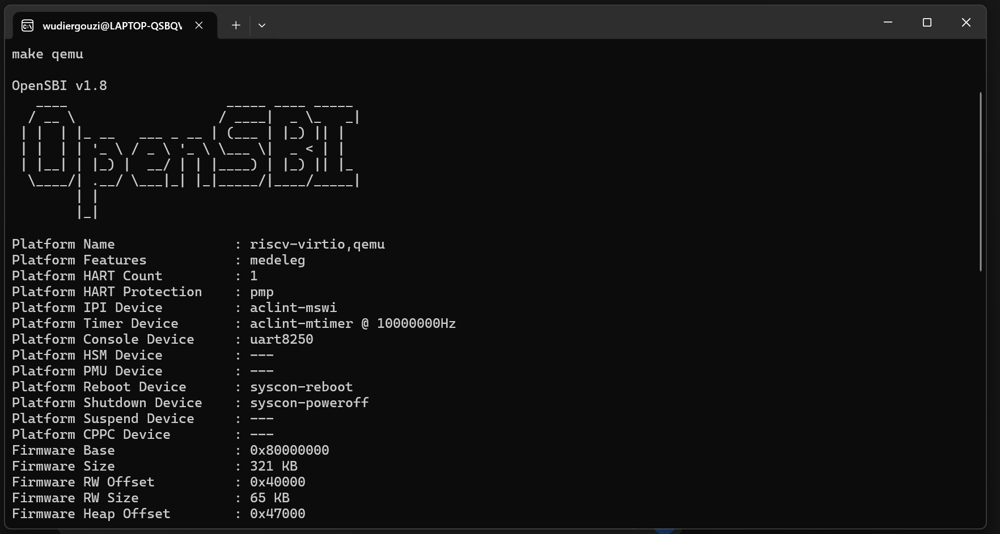
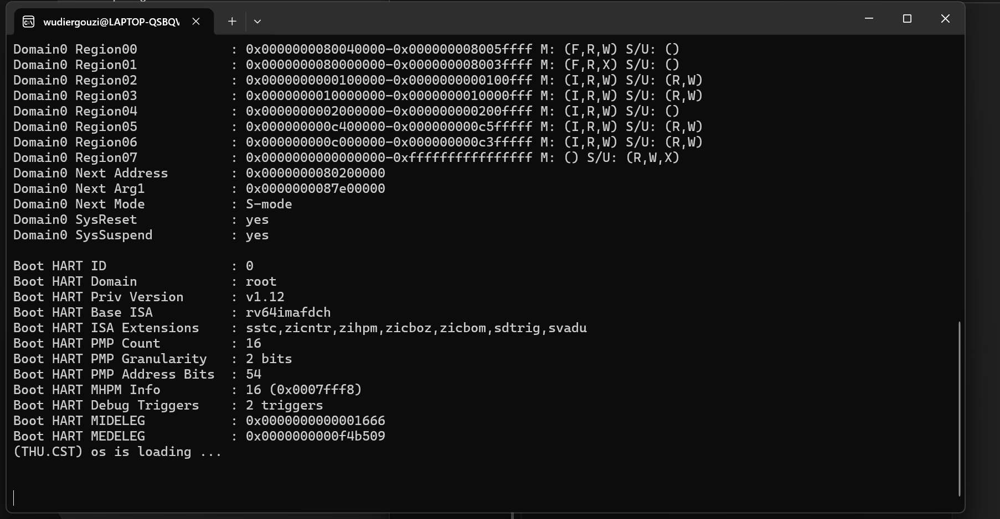

# 操作系统实验报告

## 实验基本信息

| 项目 | 内容 |
|------|------|
| **实验名称** | Lab 1：比麻雀更小的麻雀（最小可执行内核） |
| **小组成员** | 刘通（2411526）、朱信博（2411339） |
| **完成日期** | 2026-10-07 |
| **代码仓库** | <https://github.com/wudiergouzi/OS2026-liutong-and-zhuxinbo> |

### 小组分工

两人各负责一道练习，并分别整理报告中与自己练习相关的部分；实验目的、整体分析和总结由两人共同检查。

| 成员 | 负责的练习/模块 |
|------|----------------|
| 刘通（2411526） | 练习 1：入口汇编与内核栈分析；整理报告中模块分析和练习 1 的内容 |
| 朱信博（2411339） | 练习 2：QEMU/GDB 启动流程验证；整理报告中调试过程和测试结果 |

本报告由 Codex 协助整理，最后由两位成员共同复核后提交。

---

## 一、实验目的

1. 理解最小 RISC-V 内核在 QEMU `virt` 平台上的编译、链接与启动过程。
2. 理解 QEMU、OpenSBI、汇编入口 `kern_entry` 和 C 函数 `kern_init` 的控制权交接。
3. 掌握内核启动时的栈初始化、BSS 清零、SBI 控制台输出和 QEMU/GDB 调试方法。

---

## 二、实验环境

### 使用的 AI 工具

| 成员 | AI 编程工具 | 底层模型 | 备注 |
|------|------------|---------|------|
| 刘通（2411526） | Codex 桌面版 | GPT-5（初稿）、GPT-6（复核） | 用于查阅实验说明、检查源码、执行测试和修改报告。 |
| 朱信博（2411339） | 待本人确认 | 待本人确认 | 不推定其个人使用的工具或模型。 |

### 软件与硬件环境

| 项目 | 环境 |
|------|------|
| 主机系统 | Windows，工作目录 `F:\操作系统\lab1` |
| Linux 环境 | WSL Ubuntu |
| 构建工具 | Windows：`mingw32-make`；WSL：`make` |
| 目标平台 | QEMU `virt` 模拟的 64 位 RISC-V 平台 |
| 工具链 | `riscv64-unknown-elf-gcc`、`gdb-multiarch`、`qemu-system-riscv64` |

---

## 三、实验整体逻辑分析

### 3.1 本章节的逻辑主线

本章讨论的是内核如何真正开始运行。QEMU 的 `virt` 机器从 `0x1000` 的复位跳板起步；QEMU 把内核映像放在 `0x80200000`，并让 OpenSBI 在机器态完成早期初始化。OpenSBI 随后切换到 S 模式，把执行权交给内核入口。入口汇编建立栈，C 语言的 `kern_init` 才能安全执行。

### 3.2 功能的逐步实现

1. `tools/kernel.ld` 指定入口 `kern_entry` 和加载地址 `0x80200000`，使固件能正确跳入内核。
2. `kern/init/entry.S` 执行 `la sp, bootstacktop`，在进入 C 函数前建立内核栈。
3. `tail kern_init` 把控制权交给 C 初始化函数；该函数清零 BSS，满足 C 语言对未初始化静态存储期对象的零初始化约定。
4. `cprintf -> cons_putc -> sbi_console_putchar -> ecall` 调用 OpenSBI 控制台服务，输出启动消息。

---

## 四、实验内容与实现

### 功能模块：最小内核启动与控制台输出

**负责人：** 刘通（2411526）、朱信博（2411339）。刘通侧重入口和调用链分析，朱信博侧重启动验证。

#### 模块功能描述

**涉及的核心函数/入口：**

```c
int kern_init(void);
int cprintf(const char *fmt, ...);
void cons_putc(int c);
void sbi_console_putchar(unsigned char ch);
uint64_t sbi_call(uint64_t sbi_type, uint64_t arg0,
                  uint64_t arg1, uint64_t arg2);
```

```asm
kern_entry:
    la sp, bootstacktop
    tail kern_init
```

`kernel.ld` 确定内核映像的地址和入口；`entry.S` 先为内核准备栈，才跳到 C 函数。进入 `kern_init` 后，代码清零 BSS，再通过 `cprintf` 打印启动信息。单个字符经过控制台模块，由 `sbi_call` 将扩展号放入 `a7`、参数放入 `a0` 至 `a2`，执行 `ecall` 交给 OpenSBI。这条调用链虽然简单，却已经验证了内核可以从 S 模式使用固件提供的服务。

#### 最终提示词

````markdown
请根据课程 Lab 1 指导书、当前 lab1 源码和提供的报告模板整理实验一。
逐项解释 entry.S 的两条启动指令及从 0x1000 到 0x80200000 的启动过程；
核对 Makefile、链接脚本与控制台调用链；实际运行 make qemu 和 GDB，
记录命令及关键原始输出。对尚未核实的成员分工、工具使用和测试结果
保留待确认标记，不要推断。最后检查本地提交物与 GitHub 远端内容。
````

#### 实现迭代过程

##### 第一次迭代：确认代码和启动条件

**遇到的问题：**

- 课程压缩包是已经具备最小启动流程的骨架，没有要求填补的空函数。
- Windows 侧没有 `make`；WSL 初始缺少 RISC-V 交叉编译器、GDB 和 QEMU。

**问题解决策略：**

- 对照指导书检查链接脚本、入口汇编、初始化函数和 SBI 输出调用链。
- 在 WSL 中安装所需工具，随后进行实际构建和运行。

##### 第二次迭代：排除启动与调试命令的问题

原 `Makefile` 用 `-device loader` 装载二进制映像。在当前 QEMU/OpenSBI 组合中，OpenSBI 显示的下一跳为 `0x0`，内核没有打印消息。把 `qemu` 和 `debug` 目标改为 `-kernel bin/ucore.img` 后，下一跳变为 `0x80200000`，控制台出现预期信息。原 `gdb` 目标调用本机不存在的 `riscv64-unknown-elf-gdb`，现改为已安装的 `gdb-multiarch`。

这次修正只涉及启动和调试命令，内核源码未修改。重新执行 `make clean`、`make`、`make qemu`，再用 GDB 检查复位地址、栈顶和 C 入口，结果见第五节。

##### 第三次迭代：补齐本地自动检查

课程压缩包中的 `Makefile` 留有 `make grade` 目标，却没有提供它调用的 `tools/grade.sh`。本组补充了该脚本，使这个目标能在本机执行。脚本先从干净目录编译，再检查 ELF 入口为 `0x80200000`，最后启动 QEMU，确认 OpenSBI 的下一跳地址与内核输出。它是针对本实验编写的本地自检，不是课程或助教提供的评分程序；具体结果见第五节。

---

### 练习：理解内核启动中的程序入口操作

**负责人：** 刘通（2411526）。

`la sp, bootstacktop` 是加载地址伪指令，它把 `bootstacktop` 的地址载入栈指针 `sp`。`bootstack` 预留 `KSTACKSIZE` 字节，`bootstacktop` 位于高地址端；RISC-V 栈向低地址增长，因此此地址是空内核栈的初始栈顶。建立内核栈后，C 函数才能安全保存返回地址、局部变量和被调用者保存寄存器。

`tail kern_init` 是尾调用伪指令，等效于跳转到 `kern_init` 且不写入 `ra`。`kern_entry` 完成栈初始化后没有后续工作也不应返回，因此用尾调用将控制权永久移交给 C 语言初始化函数。相比普通 `call`，它不形成无用的返回链，并表达了汇编启动阶段到 C 内核的单向交接。

---

### 练习：使用 GDB 验证启动流程

**负责人：** 朱信博（2411339）。

在 WSL 的两个终端中分别执行：

```bash
# 终端 1
cd lab1
make debug

# 终端 2
cd lab1
make gdb
```

在 GDB 中先查看复位指令，再断在内核入口：

```gdb
set architecture riscv:rv64
target remote localhost:1234
x/6i 0x1000
break *0x80200000
continue
x/6i 0x80200000
info address bootstacktop
stepi
stepi
info registers pc sp
break kern_init
continue
info registers pc sp
```

实际连接时，GDB 首先停在 `pc = 0x1000`。此处的六条指令依次为 `auipc`、`addi`、`csrr a0,mhartid`、两条 `ld` 和 `jr t0`。它们建立跳转所需的参数，读取下一阶段入口，再转入 OpenSBI。设备树地址等平台信息经寄存器传给固件。这里还没有运行内核代码。

继续运行后，断点在 `0x80200000 <kern_entry>` 命中。该地址的 `la sp, bootstacktop` 被汇编为两条指令：`auipc sp,0x3` 和 `mv sp,sp`；第二条看似没有操作，但与前一条的 PC 相对寻址结果相配合。执行完两条指令后，GDB 显示 `sp = 0x80203000`，与符号 `bootstacktop` 的地址一致。再继续便在 `0x8020000a <kern_init>` 停下，说明汇编入口已经把控制权交给 C 函数。

指导书建议的 `watch *0x80200000` 在这套启动命令下不适合用来观察内核加载：QEMU 在 CPU 开始执行前就已装入映像。此处以入口断点和 OpenSBI 的 `Domain0 Next Address` 交叉核对。

```text
0x1000（QEMU 复位跳板）
  -> OpenSBI（机器态固件初始化）
  -> 0x80200000 / kern_entry（内核汇编入口）
  -> kern_init（C 语言内核初始化）
```

---

## 五、测试与验证

在 WSL Ubuntu 中，从干净构建开始执行：

```bash
make clean
make
timeout 8s make qemu
```

编译阶段八个源文件均完成编译，链接生成 `bin/kernel`，再由 `objcopy` 生成 `bin/ucore.img`。QEMU 控制台输出摘录如下：

```text
OpenSBI v1.8
Platform Name               : riscv-virtio,qemu
Domain0 Next Address        : 0x0000000080200000
(THU.CST) os is loading ...
qemu-system-riscv64: terminating on signal 15 from pid 366 (timeout)
```

`Domain0 Next Address` 与链接脚本的 `0x80200000` 一致；启动消息由 `kern_init` 打印，说明入口跳转、栈、BSS 初始化以及 SBI 控制台输出至少已共同工作到这一点。`kern_init` 最后是无限循环，故用 `timeout` 主动结束 QEMU；退出码不用于判断内核是否成功打印。

下面是本组在 WSL 终端运行 `make qemu` 时截取的画面。第一张显示启动命令和 OpenSBI 输出，第二张同时显示下一跳地址与内核打印的消息。





另一次 `make debug` + `gdb-multiarch` 调试得到了下面的关键记录：

```text
pc             0x1000
0x1000:        auipc t0,0x0
0x1004:        addi  a2,t0,40
0x1008:        csrr  a0,mhartid
0x1014:        jr    t0

Breakpoint 1, kern_entry () at kern/init/entry.S:7
pc             0x80200000
Symbol "bootstacktop" is at 0x80203000
pc             0x80200008
sp             0x80203000

Breakpoint 2, kern_init () at kern/init/init.c:8
pc             0x8020000a
sp             0x80203000
```

这里的摘录省略了部分反汇编行；两条 `stepi` 的操作步骤见第四节。GDB 记录验证了“复位向量 → 内核入口 → 栈初始化 → C 入口”这条控制流。

原始实验包缺少 `tools/grade.sh`，因此本组补充了本地自检脚本。执行 `make grade` 后得到：

```text
[Lab 1 self-check] This is a local check, not an official course score.
PASS 1/3: kernel ELF and binary image built
PASS 2/3: ELF entry is 0x80200000
PASS 3/3: OpenSBI reached the kernel and the kernel printed its message
LAB 1 LOCAL SELF-CHECK: 3/3 PASS (not an official course grade)
```

脚本会先清理并重新编译，再执行上述检查；所以这里的 `3/3 PASS` 是项目自检结果，不是助教评分。如果助教另有官方脚本，应以官方脚本的结果为准。上面的两张图片是 `make qemu` 的实际终端截图；GDB 调试结果以命令和文字记录呈现。

---

## 六、实验总结与收获

### 对操作系统的理解

| 知识点 | 本实验中的体现 | 与 OS 原理的关系 |
|--------|----------------|------------------|
| 引导过程 | QEMU 复位跳板、OpenSBI、`kern_entry` | 从复位地址到内核入口需要多个阶段，各阶段有不同职责；本实验只关注其中最短的一条启动路径。 |
| 特权级与 SBI | 内核用 `ecall` 请求输出字符 | S 模式内核可借助 M 模式固件使用平台服务；它与今后用户态程序经系统调用进入内核的方向和边界不同。 |
| 链接与加载 | `kernel.ld` 设置 `0x80200000`，QEMU 在该地址放入映像 | 链接地址与实际加载地址必须一致，处理器才能正确执行入口指令并访问符号。 |
| 内核栈 | `bootstack`、`sp` | C 函数调用依赖栈。GDB 中 `sp` 从固件栈地址变为 `bootstacktop`，可见内核确实建立了自己的执行环境。 |
| BSS | `memset(edata, 0, end - edata)` | 普通程序由运行时环境处理零初始化；本内核自己完成这一步。 |

这个内核目前只能启动和输出消息，离完整操作系统还很远。它没有建立页表，也没有异常入口、时钟中断、进程、调度或文件系统。尤其是系统调用，本实验看到的 `ecall` 是内核请求 SBI 服务，不能据此认为已经实现了面向用户程序的系统调用。

### AI 协作开发的经验

Codex 帮助梳理了入口、链接脚本和控制台调用链，也协助发现原启动命令与当前 QEMU/OpenSBI 的配合问题。但有两处只有实际运行才能确认：`-device loader` 时固件下一跳为 `0x0`；改用 `-kernel` 后才到达 `0x80200000` 并打印消息。GDB 还验证了 `sp` 的实际数值。报告中的推论因此应尽量附上源码位置或运行记录，让读者能复核，而不只写“测试通过”。
